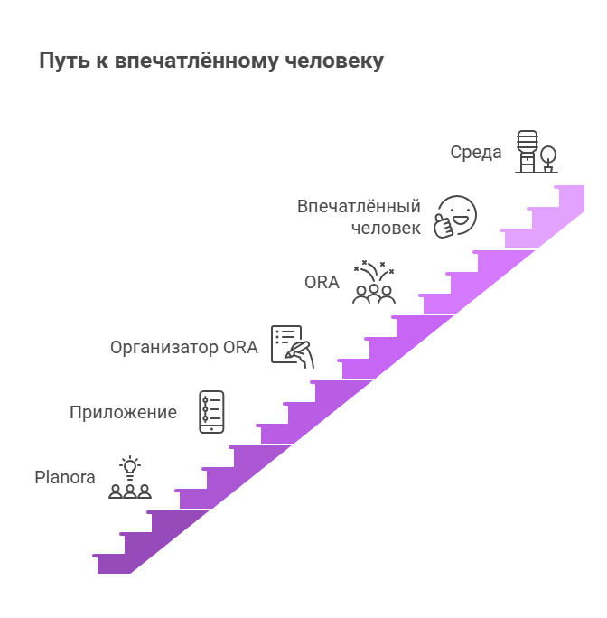
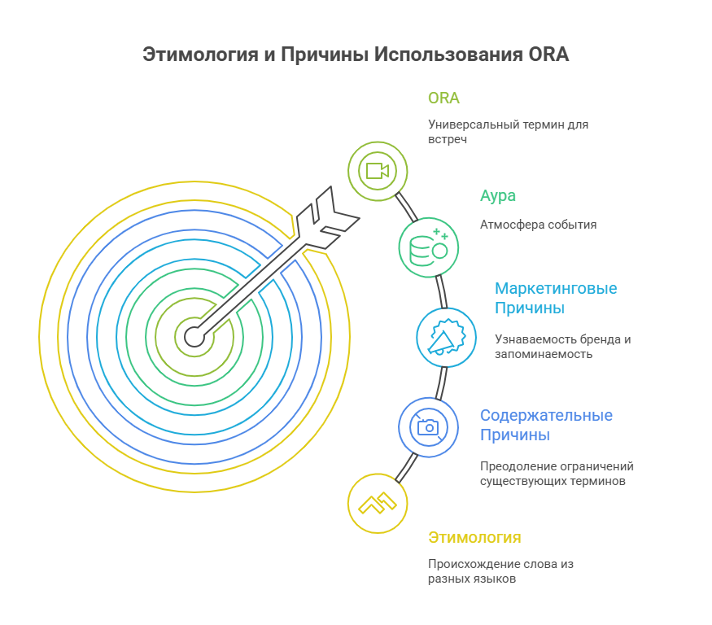
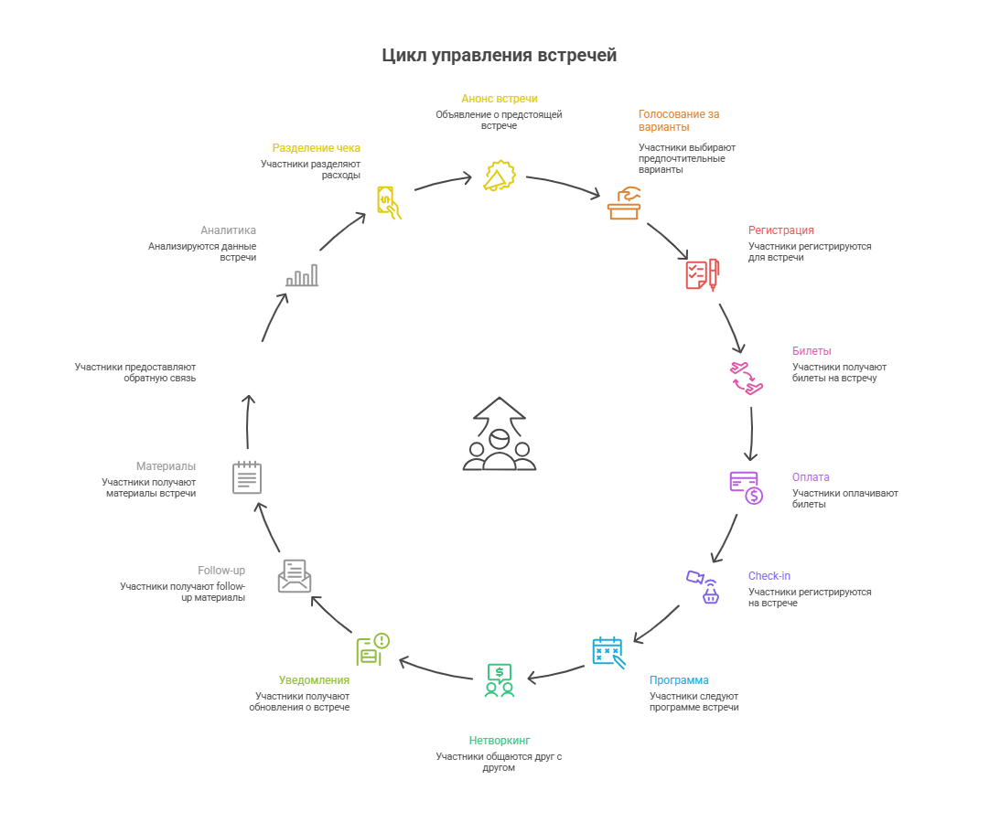
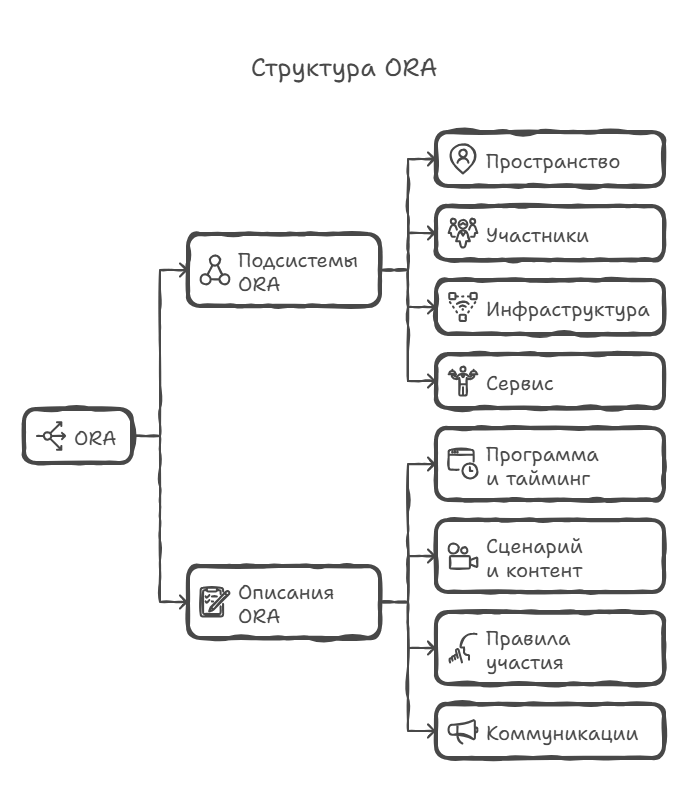
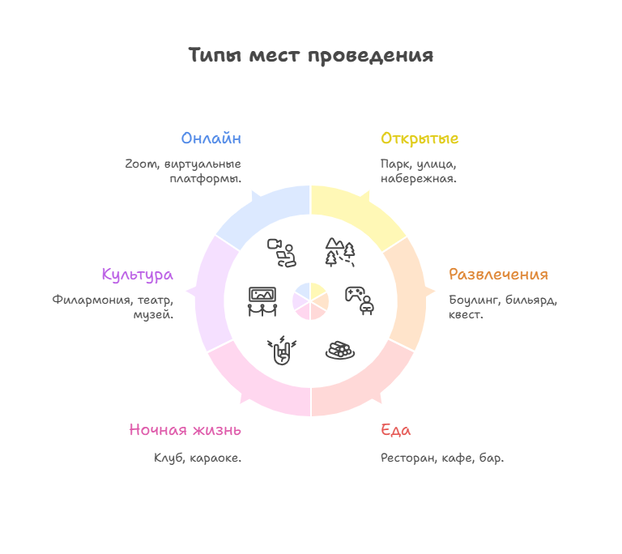
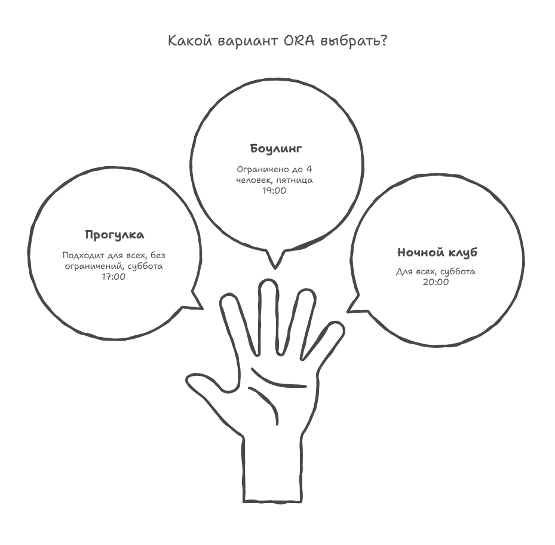

# Planora: от идеи встречи до впечатления

**Обзор проекта для команды**

---

## Цепочка создания ценности

```
Planora → Приложение → Организатор ORA → ORA → Впечатлённый человек → Среда
```



> Мы будем использовать слово **«ORA»** для того, что в культуре называют мероприятие, ивент, тусовка, культпоход, свидание и т.п.

---

## Почему ORA? Этимология

| Язык | Значение |
|------|----------|
| **Латынь** | *ora* — край, граница, берег; "молись" (от *orare*) |
| **Иврит** | אוֹרָה (*ora*) — свет |
| **Испанский** | *hora* → *ora* — час, время |
| **Японский** | 俺 (*ore/ora*) — "я" (неформальное) |
| **Аура** | Созвучно с *aura* — атмосфера, энергетика события |



---

## Почему новое слово?

### Содержательная причина

- "Мероприятие" — слишком формально, бюрократично
- "Ивент" — заимствование без смысла
- "Тусовка" — слишком неформально
- "Свидание", "прогулка в парке", "поход в филармонию", "ужин в ресторане" — слишком конкретно, не охватывает всё

**ORA** — универсальный термин для любой встречи

---

## Почему новое слово?

### Маркетинговая причина

- Уникальное слово = узнаваемый бренд
- Легко произносится на всех языках
- Короткое, запоминающееся
- Можно "застолбить" как категорию

> **ORA** — это любая встреча людей, спроектированная для создания впечатлений и с определённой аурой (aura).

---

## Что делает Приложение

| Этап | Функции |
|------|---------|
| **До ORA** | Анонс, голосование за варианты, регистрация, билеты, оплата |
| **Во время** | Check-in, программа, нетворкинг, уведомления |
| **После** | Follow-up, материалы, фидбек, аналитика, разделение чека |

**Оплата и разделение чека:**
- Один платит за всех → ведёт учёт, кто оплатил
- Сбор денег до ORA (краудфандинг)
- Разделение счёта после ORA



---

## Две главные системы

| Ядро | Главная система | Фокус | Для кого |
|------|-----------------|-------|----------|
| **A (Target)** | Впечатлённый человек | Что чувствует участник? | ORA-студия |
| **B (Product)** | Приложение | Какой инструмент создаём? | ИТ-служба |

---

## Роли пользователей

| Роль | English | Описание |
|------|---------|----------|
| **Участник** | Guest | Получает впечатления |
| **Ведущий** | Host | Ведёт активности *внутри* ORA |
| **Продюсер** | Producer | Управляет ORA *извне* |
| **Организатор** | Organizer | Создаёт и управляет через Приложение |

> Один человек может совмещать несколько ролей

---

## Что такое ORA (структура)

**Подсистемы ORA (физические компоненты):**

- 🏛️ **Пространство** — локация, зоны, навигация
- 👥 **Участники** — гости, персонал
- 🔧 **Инфраструктура** — техника, связь, реквизит
- 🍽️ **Сервис** — кейтеринг, безопасность

**Описания ORA (эпистемы):**

- 📋 Программа и тайминг
- 📝 Сценарий и контент
- 📊 Правила участия
- 📢 Коммуникации



---

## Места проведения (Venues)

| Тип | Примеры |
|-----|---------|
| Открытые | Парк, улица, набережная |
| Развлечения | Боулинг, бильярд, квест |
| Еда | Ресторан, кафе, бар |
| Ночная жизнь | Клуб, караоке |
| Культура | Филармония, театр, музей |
| Онлайн | Zoom, виртуальные платформы |



---

## Сценарий 1: Голосование за вариант ORA

```
Продюсер создаёт 3 варианта:
├── A: Прогулка по центру и в парке, без ограничений, суббота 17:00
├── B: Боулинг, до 4 человек, пятница 19:00
└── C: Ночной клуб "Апдейт", все желающие, суббота 20:00
```

**Процесс:**
1. Отправляет на голосование участникам
2. Приложение собирает голоса
3. Продюсер определяет итоговую ORA: где, во сколько, кто идёт
4. Бронирует площадку (если нужно)
5. Участники получают подтверждение



---

## Сценарий 2: Совместный сбор денег

```
Продюсер задаёт бюджет ORA
        ↓
Приложение рассчитывает стоимость на человека
        ↓
Участники подтверждают участие и платят
        ↓
Деньги собираются до порога → ORA запускается
```

---

## Сценарий 3: Спонтанная ORA

```
Пользователь создаёт "Кто сегодня свободен?"
        ↓
Друзья отмечают доступность
        ↓
Приложение предлагает Venue по геолокации
        ↓
ORA собирается за 2 часа
```

---

## Сценарий 4: Повторяющаяся ORA

```
"Пятничный ужин" — шаблон
        ↓
Каждую неделю приложение напоминает
        ↓
Участники подтверждают +1 / -1
        ↓
Приложение бронирует стол по количеству
```

---

## Сценарий 5: ORA с программой

```
Продюсер создаёт таймлайн:
├── 18:00 — Сбор, welcome-drink
├── 19:00 — Основная часть (спикер/активность)
├── 20:30 — Нетворкинг
└── 22:00 — Завершение
```

Участники видят программу → Получают уведомления о переходах

---

## Сценарий 6: Анонимный фидбек

```
После ORA:
        ↓
Участники оценивают (1-5 звёзд)
        ↓
Пишут анонимные комментарии
        ↓
Продюсер видит агрегированную статистику
        ↓
Улучшает следующую ORA
```

---

## Как мы организуем знания — SRT-метод

**Модель 3×3:**

|  | Предприниматель | Инженер | Менеджер |
|--|-----------------|---------|----------|
| | *(Зачем?)* | *(Как устроено?)* | *(Как работает?)* |
| **Надсистема** | Контекст | Окружение | Взаимодействие |
| **Целевая система** | Требования | Архитектура | Реализация |
| **Система создания** | Принципы | Платформа | Команда |


---

## Три системы (вертикаль)

| Система | Вопрос | Пример |
|---------|--------|--------|
| **Надсистема** (Suprasystem) | В какую систему встроится? | Среда человека / Организатор ORA |
| **Целевая система** (SoI) | Что создаём? | Впечатлённый человек / Приложение |
| **Система создания** (Constructor) | Кто и как создаёт? | ORA / Planora |

---

## Три роли (горизонталь)

| Роль | Вопрос | Фокус |
|------|--------|-------|
| **Предприниматель** | Зачем? | Цели, ценность, смысл |
| **Инженер** | Как устроено? | Структура, компоненты, связи |
| **Менеджер** | Как работает? | Процессы, workflow, поведение |

---

## Два ядра хранилища

```
┌──────────────────────────────────────────────────────────────────┐
│                       ЯДРО A (Target)                            │
│                                                                  │
│  Среда, в которой     →  Впечатлённый   ←  ORA                  │
│  живёт человек           человек           (ивент-продукт)       │
│                                                                  │
├────────────────────────── F19.Bridge ────────────────────────────┤
│                                                                  │
│                       ЯДРО B (Product)                           │
│                                                                  │
│  Организатор ORA      →  Приложение     ←  Planora              │
│                                                                  │
└──────────────────────────────────────────────────────────────────┘
```

---

## 19 семейств документов

| Ядро | Семейства | Содержание |
|------|-----------|------------|
| **A (Target)** | A1.1 — A3.3 | Впечатления, участники, ORA |
| **B (Product)** | B1.1 — B3.3 | Приложение, организаторы, Planora |
| **F19** | Метасистема | Управление хранилищем + мосты |

**Итого: 9 + 9 + 1 = 19 семейств**

---

## Структура Planora

| Часть | Ответственность |
|-------|-----------------|
| **ИТ-служба** | Создание, развитие и эксплуатация Приложения |
| **ORA-студия** | Внедрение, обучение организаторов, методики |

---

## Навигация по хранилищу

```
Planora/
├── Repository-management/        ← управление, стандарты, глоссарий
│   ├── 0.1. Knowledge-Base-Logic/
│   ├── 0.2. Repository-Processes/
│   └── 0.3. Plans-and-Meetings/
│
├── Systems-Description/
│   ├── A.Target/                 ← знания о впечатлениях
│   └── B.Product/                ← знания о приложении
│
└── .fpf/                         ← принципы FPF
```

---

## Как найти нужный документ

```
1. Это метасистема?
   └── Да → Repository-management (F19)

2. О впечатлениях / участниках / ORA?
   └── Да → Ядро A (Systems-Description/A.Target/)

3. О приложении / организаторах / Planora?
   └── Да → Ядро B (Systems-Description/B.Product/)

4. Какая система? → Надсистема / Целевая / Создания

5. Какой аспект? → Зачем / Как устроено / Как работает
```

---

## Ключевые термины

| Термин | Значение |
|--------|----------|
| **ORA** | Встреча с аурой для создания впечатлений |
| **Холон** | Сущность, которая одновременно целое и часть |
| **Эпистема** | Документ, описание (не физический объект) |
| **SSOT** | Single Source of Truth — один источник истины |
| **F-G-R** | Формальность-Область-Надёжность |

---

## Принцип строгого различения (A.7)

| Путаница | Правильно |
|----------|-----------|
| Документ "делает" | Система делает, документ **описывает** |
| Роль = Человек | Роль — функция, человек — исполнитель |
| План = Реальность | План — WorkPlan, реальность — Work |

> Описание ≠ Объект

---

## Для ИТ-службы

**Где искать информацию:**

- `B2.Target-system-App/` — архитектура приложения
- `B2.1.Предприниматель/` — требования
- `B2.2.Инженер/` — компоненты, API
- `B3.3.Менеджер/` — процессы команды

---

## Для ORA-студии

**Где искать информацию:**

- `A3.Constructor-ORA/` — методики мероприятий
- `A2.System-of-Interest/` — впечатлённость
- `A2.3.Менеджер/` — путь участника
- `A3.2.Инженер/` — структура ORA

---

## Итоги

| Вопрос | Ответ |
|--------|-------|
| **ЧТО?** | Приложение для создания ORA |
| **ДЛЯ КОГО?** | Продюсеры, организаторы, участники |
| **КАК?** | SRT-метод: 3×3 × 2 ядра + F19 |

---

## Быстрый старт

1. **Прочитать** `README.md` — общий обзор
2. **Изучить** `glossary.md` — терминология
3. **Выбрать** своё ядро:
   - ORA-студия → Ядро A
   - ИТ-служба → Ядро B
4. **Начать** с целевой системы (A2 или B2)

---

# Вопросы?

**Ссылки:**
- [README.md](../../README.md)
- [Глоссарий](../0.1.%20Knowledge-Base-Logic/glossary.md)
- [Модель семейств](../0.1.%20Knowledge-Base-Logic/document-families.md)

---

<!--
_class: lead
_backgroundColor: #2563eb
_color: white
-->

# Спасибо!

**Planora: от идеи встречи до впечатления**
